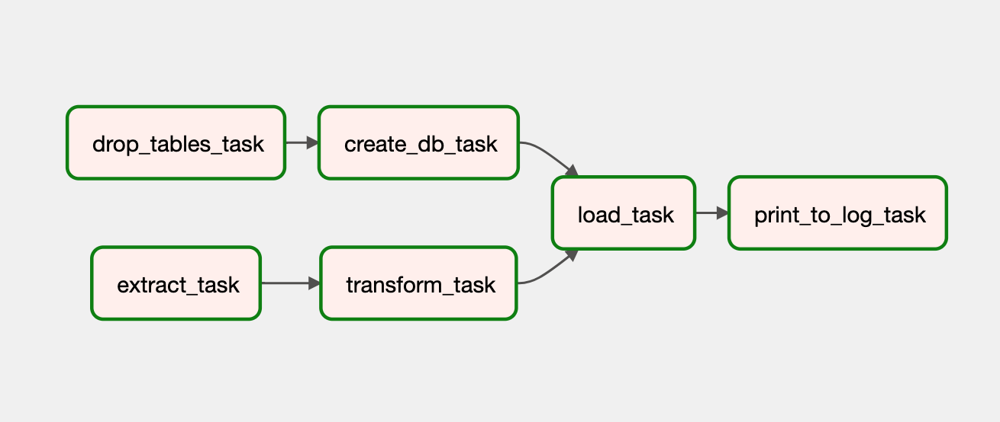
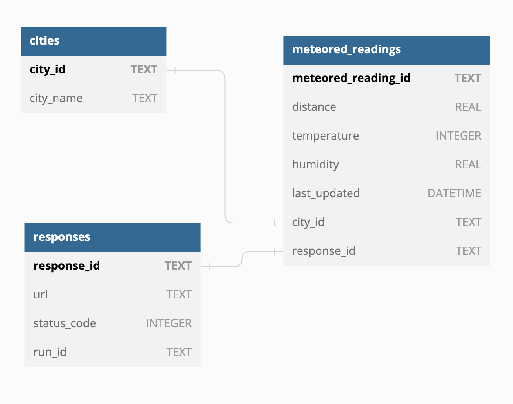
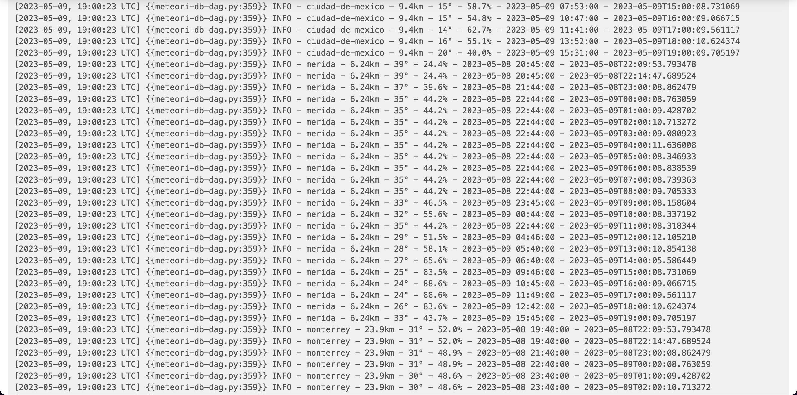

# meteori-db

**Project Meteori DB** is a weather data scraper and processing solution. This project provides a solution for scraping weather data from a list of websites and processing it for later modeling purposes. It includes a web scraper, data processing scripts, and integration with a SQLite database. The solution automates the workflow using Airflow and provides a summary of the data in a Parquet file.

## Features

- Scrapes weather data from multiple cities at an hourly basis.
- Formats the scraped data using JSON notation, including the request details, HTTP response code, and requested data.
- Processes and standardizes the data for insertion into a SQLite database.
- Automated workflow management using Airflow.
- Managed environment using AWS Managed Workflows for Apache Airflow (MWAA).

### Pending Features

- Generate a Parquet file with a summary of the weather data for each city.
- Dockerized solution for easy deployment and reproducibility.
- Data integrity tests and validation processes.
- Data visualization through a dashboard.

## Getting Started

To get started with the solution, follow the instructions below:

### Prerequisites

- Python 3.x installed
- AWS credentials (provided by email)

## Usage

1. Login to AWS MWAA Console using the email-provided **epic-dd360-user** credentials. [AWS MWAA Console](https://us-east-1.console.aws.amazon.com/mwaa/home?region=us-east-1#environments/meteori-db-airflow-env).
2. Navigate to the [Airflow UI](https://61cd09f8-8942-4d7f-94d7-0cf77c552e94.c38.us-east-1.airflow.amazonaws.com/dags/meteori-db-dag-2/graph?root=&execution_date=2023-05-09T16%3A00%3A00%2B00%3A00).

## DAG Tour



The Meteori DB DAG is composed of five tasks.

### drop_tables_task

```python
@task()
    def drop_tables_task(skip=True):
        if skip:
            return None

        feeling = TaskFeeling['OK']
        conn = sqlite3.connect('meteori.db')
        cursor = conn.cursor()

        try:
            drop_table_query = 'DROP TABLE IF EXISTS meteored_readings;'
            cursor.execute(drop_table_query)

            drop_table_query = 'DROP TABLE IF EXISTS cities;'
            cursor.execute(drop_table_query)

            drop_table_query = 'DROP TABLE IF EXISTS responses;'
            cursor.execute(drop_table_query)

            conn.commit()
        except sqlite3.Error as e:
            log.error(f'Error dropping tables: {e}')
            feeling = TaskFeeling['BAD_ABOUT_SQL_ERROR']
        finally:
            cursor.close()
            conn.close()

        return feeling
```

This task was implemented with debugging purposes only, and should normally be skipped.

> **About the TaskFeeling dictionary:** I needed an internal status messaging system, but naming it Status would have made it confusing between Airflow task statuses and HTTP response statuses. Return codes do not tell much information. TaskFeeling is the middle ground that helps tasks tell other tasks how well they are feeling regarding its execution (i.e. communicate status).

### create_db_task

```python
@task()
    def create_db_task(drop_tables_feeling: int):
        if drop_tables_feeling == TaskFeeling['OK']:
            log.debug('drop_tables_task is feeling OK.')

        feeling = TaskFeeling['OK']
        conn = sqlite3.connect('meteori.db')
        cursor = conn.cursor()

        try:
            conn.execute("PRAGMA foreign_keys = ON;")

            create_table_query = '''
            CREATE TABLE IF NOT EXISTS responses (
                response_id TEXT PRIMARY KEY,
                url TEXT,
                status_code INTEGER,
                run_id TEXT
            );
            '''
            cursor.execute(create_table_query)

            create_table_query = '''
            CREATE TABLE IF NOT EXISTS cities (
                city_id TEXT PRIMARY KEY,
                city_name TEXT
            );
            '''
            cursor.execute(create_table_query)

            create_table_query = '''
            CREATE TABLE IF NOT EXISTS meteored_readings (
                meteored_reading_id TEXT PRIMARY KEY,
                distance REAL,
                temperature INTEGER,
                humidity REAL,
                last_updated DATETIME,
                city_id TEXT,
                response_id TEXT,
                FOREIGN KEY (city_id) REFERENCES cities (city_id),
                FOREIGN KEY (response_id) REFERENCES responses (response_id)
            );
            '''
            cursor.execute(create_table_query)

            conn.commit()
        except sqlite3.Error as e:
            log.error(f'Error creating tables: {e}')
            feeling = TaskFeeling['BAD_ABOUT_SQL_ERROR']
        finally:
            cursor.close()
            conn.close()

        return feeling
```

Creates three tables in the SQLite3 DB if they do not exist, resulting in the following architecture:



> **Why are IDs not auto-incremmental integers?** I decided to use UUIDs instead, providing the DAG less dependency on DB insertions: generate UUIDs, store them in JSON and insert to DB when needed, no additional reads required.

### extract_task

```python
@task()
    def extract_task(url_list: 'list[str]' = default_url_list):
        city_data_list: 'list[dict]' = []
        run_id = f'{datetime.now().isoformat()}'

        for url in url_list:
            try:
                response = requests.get(url)
                city_data_list.append(parse_response(run_id, response))
                response.raise_for_status()
                log.info(f'Received data from {url}')

            except requests.HTTPError as e:
                log.error(f'Error scraping {url}): {str(e)}')

        return city_data_list
```

1. The extraction tasks sets the run_id, which is assigned to every value read afterwards.
2. For each website url, parse the response with the generated run_id

```python
def parse_response(run_id: str, response: requests.Response = None) -> 'dict':
        city_name = response.url.split('/')[-2]
        url = response.url
        city_dict = {
            'response_id': str(uuid.uuid4()),
            'meteored_reading_id': str(uuid.uuid4()),
            'run_id': run_id,
            'city_name': city_name,
            'url': url,
            'status_code': response.status_code
        }

        if response.status_code == 200:
            try:
                city_dict.update({
                    'distance': extract(ExtractPatternKey['distance'], response),
                    'last_updated': extract(ExtractPatternKey['last_updated'], response),
                    'temperature': extract(ExtractPatternKey['temperature'], response),
                    'humidity': extract(ExtractPatternKey['humidity'], response),
                })
            except ValueError as e:
                log.error(
                    'Hint: use one of these: '
                    f'{ExtractPatternKey.keys()}.'
                    f'{e}'
                )
                return None

        return city_dict
```

3. A dictionary is created for each city data retrieved. Calling the ´´´extract()´´´ function with an invalid value is handled by providing a hint.

   - The ExtractPatternKey['temperature'] dictionary can be subtituted by a more apt enumerator or typing, which should be JSON serializable.

```python
def extract(pattern: str, response: requests.Response):
text = response.text
match: re.Match = None

        if pattern == ExtractPatternKey['distance']:
            match = re.search(r'<span id="dist_cant">([\d.]+)km<\/span>', text)
        elif pattern == ExtractPatternKey['last_updated']:
            match = re.search(r'<span id="fecha_act_dato">(.+?)<\/span>', text)
        elif pattern == ExtractPatternKey['temperature']:
            match = re.search(r'<span id="ult_dato_temp">(\d+)<\/span>', text)
        elif pattern == ExtractPatternKey['humidity']:
            match = re.search(
                r'<span id="ult_dato_hum">([\d.]+)<\/span>', text)
        else:
            raise ValueError(f'Unknown pattern {pattern}')

        if match:
            value = match.group(1)
            return value
        else:
            log.warn(f'No match found for {pattern} in {response.url}')
            return None
```

4. Regular expressions are used to extract data from the response's text. In the best case scenario, these values are always numbers. We will make sure of this in the ´´´transform_task()´´´

### transform_task

```python
@task()
def transform_task(city_data_list: 'list[dict]'):
    # NOTE: this transformation is symbolic, as the data is moved
    # as a string from task to task when Airflow auto-serializes it.

    transformed_city_data_list: 'list[dict]' = []

    for city_data in city_data_list:
        transformed_city_data = city_data.copy()

        transformed_city_data.update({
            'status_code': int(city_data['status_code'])
        })

        if transformed_city_data['status_code'] != 200:
            continue

        transformed_city_data.update({
            'distance': float(city_data['distance']),
            'last_updated': city_data['last_updated'],
            'temperature': int(city_data['temperature']),
            'humidity': float(city_data['humidity']),
        })

        transformed_city_data_list.append(transformed_city_data)

    return transformed_city_data_list
```

Since data is moved from task to task by serializing it to a JSON string, this data type transformations are symbollic. More complex transformations can be performed here, such as calculating temperature in Farenheit and Kelvin units.

# load_task

```python
@task()
def load_task(city_data_list: 'list[dict]', create_db_feeling: int):
    if create_db_feeling == TaskFeeling['OK']:
        log.debug(f'create_db_task is feeling OK.')

    feeling = TaskFeeling['OK']
    conn = sqlite3.connect('meteori.db')
    cursor = conn.cursor()

    try:
        insert_responses(cursor, city_data_list)
        insert_cities(cursor, city_data_list)
        insert_meteored_readings(cursor, city_data_list)
    except Exception as e:
        log.error(f'Unexpected error loading data: {e}')
        feeling = TaskFeeling['BAD_ABOUT_SQL_ERROR']
    finally:
        cursor.close()
        conn.close()

    return feeling
```

1. Create a cursor that is shared across DB insertions.

```python
def insert_responses(cursor: sqlite3.Cursor, city_data_list: 'list[dict]'):
    try:
        insert_data_query = '''
        INSERT INTO responses (response_id, url, status_code, run_id)
        VALUES (?, ?, ?, ?);
        '''
        data = [(city_data['response_id'], city_data['url'], city_data['status_code'], city_data['run_id'])
                for city_data in city_data_list]
        cursor.executemany(insert_data_query, data)
        cursor.connection.commit()
    except sqlite3.Error as e:
        log.error(f'Error inserting response data: {e}')
```

2. `responses` insertion is pretty straight forward.

```python
def insert_cities(cursor: sqlite3.Cursor, city_data_list: 'list[dict]'):
    try:
        for city_data in city_data_list:
            if city_data['status_code'] != 200:
                continue

            cursor.execute(
                "SELECT city_id FROM cities WHERE city_name = ?", (city_data['city_name'],))
            existing_city = cursor.fetchone()

            if existing_city:
                city_id = existing_city[0]
                city_data['city_id'] = city_id
            else:
                city_id = str(uuid.uuid4())
                city_data['city_id'] = city_id
                cursor.execute(
                    "INSERT INTO cities (city_id, city_name) VALUES (?, ?)", (city_id, city_data['city_name']))

        cursor.connection.commit()
    except sqlite3.Error as e:
        log.error(f'Error inserting city data: {e}')
```

3. Check if the city for this city reading has already been inserted, if so, fetch its UUID from the DB. Otherwise insert normally.

```python
def insert_meteored_readings(cursor: sqlite3.Cursor, city_data_list: 'list[dict]'):
    try:
        insert_data_query = '''
        INSERT INTO meteored_readings (
            meteored_reading_id,
            distance,
            temperature,
            humidity,
            last_updated,
            city_id,
            response_id
        ) VALUES (?, ?, ?, ?, ?, ?, ?);
        '''
        data = []

        for city_data in city_data_list:
            if city_data['status_code'] != 200:
                continue
            data.append((
                city_data['meteored_reading_id'],
                city_data['distance'],
                city_data['temperature'],
                city_data['humidity'],
                transform_date(city_data['last_updated']),
                city_data['city_id'],
                city_data['response_id']
            ))

        cursor.executemany(insert_data_query, data)
        cursor.connection.commit()
    except sqlite3.Error as e:
        log.error(f'Error inserting meteored reading data: {e}')
```

3. Insertion to meteored_readings is pretty straight forward thanks to the use of UUIDs stored in the JSON string.

# print_to_log_task

```python
@task()
def print_to_log_task(load_task_feeling: int):
    if load_task_feeling == TaskFeeling['OK']:
        log.debug(f'load_task is feeling OK.')

    conn = sqlite3.connect('meteori.db')
    cursor = conn.cursor()

    try:

        select_query = '''
        SELECT
            c.city_name,
            mr.distance,
            mr.temperature,
            mr.humidity,
            mr.last_updated,
            r.run_id
        FROM
            meteored_readings AS mr
            INNER JOIN cities AS c ON mr.city_id = c.city_id
            INNER JOIN responses AS r ON mr.response_id = r.response_id
        WHERE
            mr.last_updated > ?
        ORDER BY
            c.city_name ASC;
        '''

        cursor.execute(
            select_query,
            (datetime.now() - timedelta(days=1),)
        )

        result = cursor.fetchall()
        for row in result:
            log.info(
                f'{row[0]} - {row[1]}km - {row[2]}° - {row[3]}% - {row[4]} - {row[5]}')

        cursor.connection.commit()
    except sqlite3.Error as e:
        log.error(f'Error selecting data: {e}')
    finally:
        cursor.close()
        conn.close()
```

Select everything from meteored_readings, where only successful readings are stored, inner join excludes null data. Them, simply print to log.



## Contributing

Contributions to this project are welcome. To contribute, follow these steps:

1. Fork the repository.
2. Create a new branch: `git checkout -b feature/my-feature`
3. Make the necessary changes and commit them: `git commit -m "Add feature"`
4. Push to the branch: `git push origin feature/my-feature`
5. Open a pull request in the repository.

## License

This project is licensed under the MIT License.

## Contact

For any questions or inquiries, please contact **epicLevi** at [levi.carbellido@outlook.com](levi.carbellido@outlook.com).

## Further Improvements

The current solution provides the basic functionality required for weather data scraping, processing, and storage. However, several improvements can be made to enhance the solution:

- Generate a Parquet file with a summary of the weather data for each city.
- Dockerized solution for easy deployment and reproducibility.
- Data integrity tests and validation processes.
- Data visualization through a dashboard.
- Better error handling and retry mechanisms for failed requests, current error handling is ratter "dumb", as it does not adress the causes of errors.
- Enhance data cleaning and standardization processes.
- Implement more sophisticated data validation and integrity tests, current solution will work for and only for meteored websites.
- Explore options for scaling the solution to handle larger datasets or more frequent updates.
- Integrate with cloud-based services for increased reliability and scalability. e.g.:
  - AWS Data Lake Analytics with Apache Zeppelin, for data visualization.
  - AWS Amazon RDS for PostgreSQL, for data storage.

These improvements can be implemented based on specific use cases and requirements.

```

```
